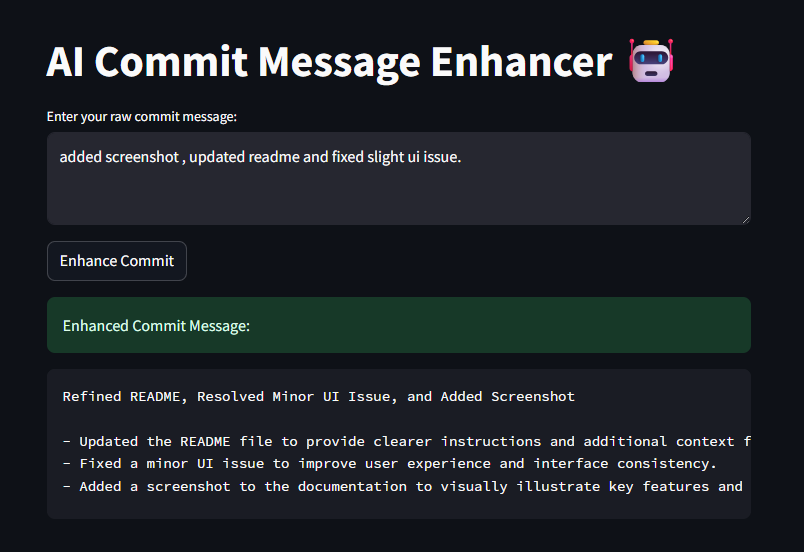

# AI-Powered Commit Message Enhancer

## Overview

Developers often write vague commit messages like (Yes i am part of this crowd 🫣):

> `fix bug`  
> `update file`  
> `final version`

Clear, descriptive commit messages are essential for better collaboration, code reviews, and long-term maintainability.

This mini-tool uses LLM-based prompt engineering to automatically enhance raw commit messages into clear, professional statements — making every commit count.

---

## Features

- Converts simple commit messages into well-structured, descriptive commits
- Powered by OpenAI GPT-4 API
- CLI and Streamlit UI versions included

---

## Sample Input & Output

**Input:**

> `fix bug in payment api`

**Output:**

> `Resolved payment API issue by handling null request parameters, ensuring consistent transaction processing.`

---

## Stack

- Python 3
- OpenAI GPT-4 API
- Streamlit (optional UI)
- python-dotenv

---

## Getting Started

### 1️. Clone this repo

```bash
git clone https://github.com/your-username/commit-message-enhancer.git
cd commit-message-enhancer
```

### 2️. Install dependencies

```bash
pip install -r requirements.txt
```

### 3️. Set up your OpenAI API key

Create a .env file in the project root:

```ini
OPENAI_API_KEY=your-api-key-here
```

**⚠️ Note: Never share your API keys publicly.**

### 4️. Run CLI version

```bash
python commit_enhancer.py
```

### 5️. Run Streamlit UI (optional)

```bash
streamlit run streamlit_ui.py
```

---

## Demo Screenshot



## Future Improvements

> `Bulk enhancement for multiple commits`  
> `Git pre-commit hook integration`  
> `Domain-specific fine-tuning`

---

Author
Built with curiosity by Sirisha

Connect on [LinkedIn](https://www.linkedin.com/in/sirisha-nippani/)
